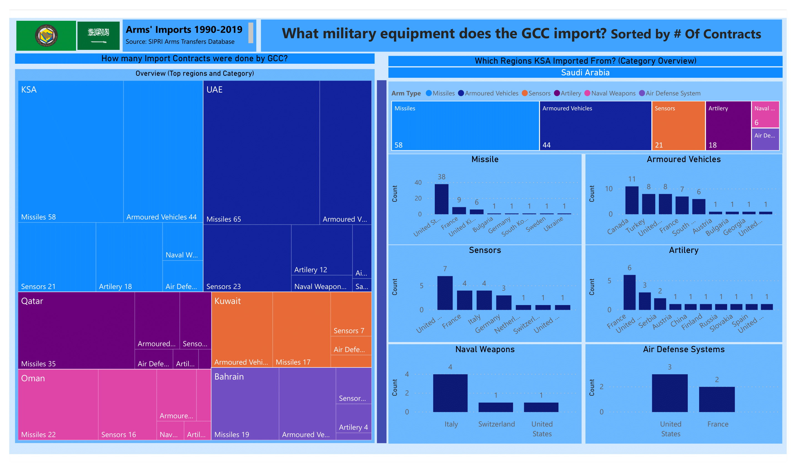
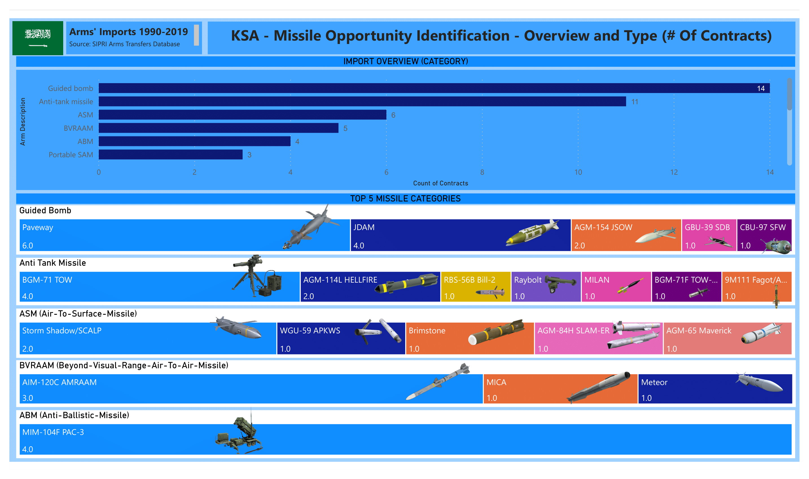
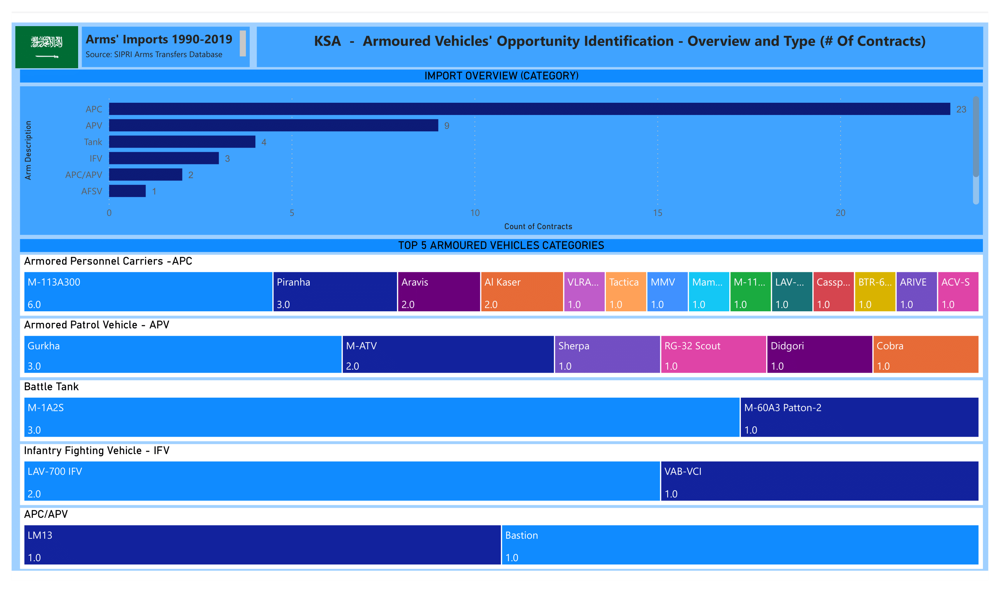
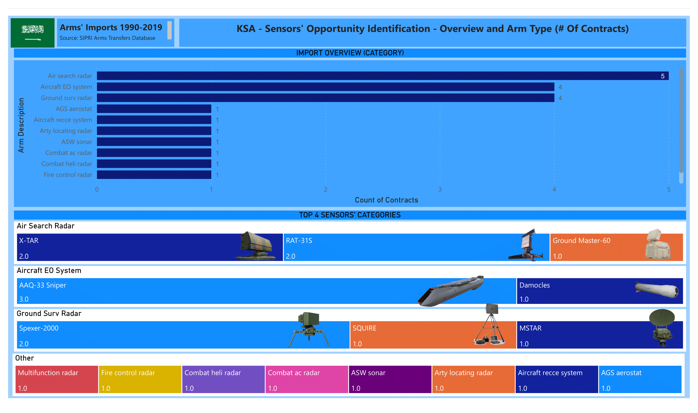

# Defense-Security-Systems
Hey! Welcome to my Defense and Security Systems' Insights Repository. GCC has been heavily reliant on imports; Hence, data of imports of military equipment is highly reliable for Defense and Security Systems RD organizations in the region to identify relevant opportunities to grow. Import data shows much of what the warfighter needs on the battlefield. Hence, the visualizations in this repository could be used as a starting point to; (a) direct an organization's long-term strategy, (b) evaluate current projects in the pipeline and develop a framework to redirect initiatives towards meaningful growth 

## Overview of GCC military eqipment imports
This visualization provides an overview of the imports in each category sorted by the number of contracts done by each region in the GCC. Furthermore, the dashboard provides an overview of Kingdom imports and top suppliers of each category sorted by the number of contracts done.
### GCC
- KSA is the largest importer in the GCC, followed by the UAE, Qatar, Oman, Kuwait, & Bahrain.
- The top 2 arm categories imported to GCC  Are Missile and Armoured Vehicles.
#### Kingdom Of Saudi Arabia
The top 3 arm categories imported to KSA are Missile, Armoured Vehicle, and Sensors.
- Missile is the largest arm category imported by KSA. The region signed the highest number of contacts with the USA, France, and the UK.
- Armoured Vehicle is the second largest arm category imported by KSA. The region signed the most contracts with Canada, Turkey, United States, France, and South Africa.
- Sensor is the third-largest arm category imported by KSA. The region signed the most contracts with United States, France, Italy, and Germany.
- Artillery is the fourth largest arm category imported by KSA. The region signed the most contracts with France, the United States, and Serbia.
- Naval Weapons and Air Defense Systems are the smallest categories. The region signed the most contracts with Italy, United States, and France.

        

### Accelerating Vision 2030- A Guide for devising Capabilities Roadmap for RD Centres in the Kingdom
#### Missile
Guided bomb and Anti-Missile tank are the biggest categories and BVRAAM and ABM are the smallest missile categories according to number of import contracts. RD centers in the Kingdom should look into acquiring talent to steer focus towards developing: 
- Paveway, JDAM & AGM-154 JSOW in the Guided Bomb Missile Category.
- BGM71 TOW, AGM-114L HELLFIRE in the Anti-Tank Missile Category.
- Shadow/SCALP in the ASM Category.
- AIM-120C AMRAAM in the BVRAAM Category.
- MIM-104F PAC-3 in the ABM Category.

#### Armoured Vehicles
Armoured Personnel Carriers (APC) and Armoured Patrol Vehicles (APV) are the biggest categories and Battle Tank, Infantry Fighting Vehicle (IFV) and APC/APV are the smallest missile categories according to number of import contracts. RD centres in the Kingdom should look into acquiring talent to steer focus towards developing:
- M-113Z300, Piranha, Aravis, and Al-Kaser in Armoured Personnel Carriers (APC) Category.
- Gurkha and M-ATV in Armoured Patrol Vehicles (APV) Category.
- M-1A2S in Battle Tank Category.
- LAV-700 IFV in IFV Category.
- LM13 and Bastion in APC/APV Category.

#### Sensors
Air Search Radar, Aircraft EO System and Ground Surv Radar are the biggest categories Other Radars Imported with 1 contract each are namely; multifunction radar, fire control radar, combat heli radar, combat ac radar, ASW sonar, Arty locating radar, Aircraft recce system, and AGS aerostat. RD centres in the Kingdom should look into acquiring talent to steer focus towards developing:
- X-TAR and RAT-31S in Air Search Radar Category.
- AAQ-33 Sniper in Aircraft EO System Category.
- Spexer-2000 in Ground Surv Radar Category.

#### Amplifying network strength
A smart manufacturing ecosystem can be created when all entities namely; production, supply chain, customer, and talent come together to solve shared challenges and meet shared objectives. As RD centers fall under the 'Production' node in a national defense network, such insights could help garner a starting point to gain a wholistic view and fuel the Kingdom towards achieving national sovereignty.

